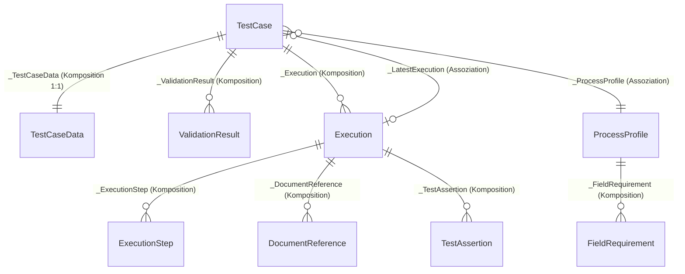
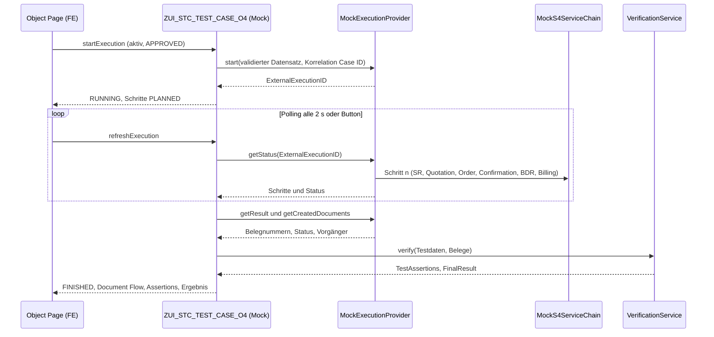

# Phase 1 — Architektur- & Mock-Contract-Validation

**Service-to-Cash Test Automation Assistant · UI5-Mockup (SAP Fiori elements for OData V4 + Flexible Programming Model)**

| | |
|---|---|
| Projekt | `zstc.testautomation` (App-Verzeichnis `zstc-testautomation/` ab Phase 2) |
| Phase | 1 von 6 — Architektur- & Mock-Contract-Validation |
| Stand | 28.09.2026 |
| Status | Geliefert. Auf Wunsch nach einem nutzbaren Mockup wurden die Phasen 2–6 anschließend umgesetzt: [`zstc-testautomation/README.md`](../zstc-testautomation/README.md), [`mock-to-real-mapping.md`](mock-to-real-mapping.md) |
| Auftrag | [`prompt.md`](../prompt.md) (inkl. Anhänge A–E) |

## Inhalt

0. [Kurzfassung](#0-kurzfassung)
1. [Research-Basis, Quellenlage und Legende](#1-research-basis-quellenlage-und-legende)
2. [Empfohlene UI- und Mock-Architektur](#2-empfohlene-ui--und-mock-architektur)
3. [OData-V4-Mock-Vertrag `ZUI_STC_TEST_CASE_O4`](#3-odata-v4-mock-vertrag-zui_stc_test_case_o4)
4. [Edition- und Release-Annahmen](#4-edition--und-release-annahmen)
5. [Reale Andock-Ziele (Vorab-Mapping Mock → Real)](#5-reale-andock-ziele-vorab-mapping-mock--real)
6. [Offene Fragen und Blocker](#6-offene-fragen-und-blocker)
7. [Definition of Done (Mockup)](#7-definition-of-done-mockup)
8. [Projektstruktur](#8-projektstruktur)
9. [Ausblick Phasen 2–6](#9-ausblick-phasen-26)
10. [Übersichtstabelle](#10-übersichtstabelle)
11. [Go / No-Go](#11-go--no-go)
- [Anhang A — Quellen](#anhang-a--quellen)
- [Anhang B — Verifizierte Feldlisten der realen APIs (Auszug)](#anhang-b--verifizierte-feldlisten-der-realen-apis-auszug)

---

## 0. Kurzfassung

1. **UI-Technologie:** SAP Fiori elements for OData V4 mit Flexible Programming Model auf **SAPUI5 1.136 (Long-Term Maintenance)**. Das ist die SAPUI5-Linie des SAP Fiori Front-End Servers 2025 und damit die von S/4HANA 2025 im Embedded Deployment. Theme `sap_horizon`.
2. **Mock-Backend:** `@sap-ux/ui5-middleware-fe-mockserver` **2.4.17** (SAP Fiori tools, Open Source) läuft als Middleware in `ui5 serve` (UI5 CLI **4.0.70**). Der Mockserver liefert `$metadata`, Annotationen und JSON-Mock-Daten. Pro Entitätsmenge führt er JavaScript-Handler aus (`executeAction`, `onDraftPrepare`, `onAfterRead`, `throwError`, `addMessage`, `getEntityInterface`). Draft mit RAP-Aktionsnamen, `$search`, `$apply` und `sap-messages` sind im Mockserver implementiert; das ist am Quellcode geprüft.
3. **App-Shell:** lokales SAP Fiori Launchpad (Sandbox) über `@sap-ux/preview-middleware` (`/test/flp.html`). Es gibt eine App mit dem Intent `ServiceTestCase-manage`.
4. **Seiten:**
   - **Overview** = FPM Custom Page (`sap.fe.core.fpm`)
   - **Test Cases** = List Report
   - **New Test Case** = Object Page im Draft-Create-Modus
   - **Configuration** = List Report und Object Page auf `ProcessProfile` mit Tabelle `FieldRequirement`

   Validation, Approval, Execution und Test Result sind Sections und Aktionen der Test-Case-Object-Page. Einziges Freestyle-Element ist der Document Flow (`sap.suite.ui.commons.ProcessFlow` in einer FPM Custom Section).
5. **Vertrag:** Der V4-Service `ZUI_STC_TEST_CASE_O4` ist RAP-konform aufgebaut: Namespace `com.sap.gateway.srvd.zui_stc_test_case.v0001`, Typnamen `<Alias>Type`, UUID-Schlüssel plus `IsActiveEntity`, `SAP__Messages`, `__OperationControl`, `__FieldControl`. Diese Konventionen sind an **echten SAP-RAP-Metadaten** geprüft. Fachliche Felder tragen die Namen der **released APIs** (`A_ServiceRequest`, `A_ServiceOrder(Item)`, `A_ServiceConfirmation`, `A_BillingDocument(Request)`, `API_EQUIPMENT`, `API_FUNCTIONALLOCATION`, `API_BUSINESS_PARTNER`); die Namen sind über das SAP Cloud SDK VDM verifiziert.
6. **Pflichtfelder** kommen ausschließlich aus `FieldRequirement` und wirken an zwei Stellen: im UI über dynamisches `Common.FieldControl` (Pflichtmarkierung) und in der deterministischen Validierung. Nichts ist hartcodiert.
7. **Abgleich (`validate`)** läuft im Edit-Modus (Draft), denn laut SAP-Doku gibt es State-Messages (Ampel je Feld im Message-Popover) **nur im Edit-Modus** der Object Page. Im Display-Modus liefert `revalidate` Transition-Messages.
8. **Execution** läuft asynchron über `ITestExecutionProvider` → `MockExecutionProvider`:
   - Der Provider vergibt eine `ExternalExecutionID` und durchläuft sichtbare Schritte.
   - Der Status wird über `refreshExecution` abgefragt (Polling).
   - Belegnummern entstehen erst am Ende.

   **Verification** rechnet echt auf den Mock-Belegen: Der Nettowert 3.693,00 EUR ergibt sich aus einer Mock-Preisliste und ist nicht vorgegeben.
9. **Reale Lage:**
   - Service Order hat ab S/4HANA 2025 den V4-Nachfolger `OP_SERVICEORDER_0001`; `API_SERVICE_ORDER_SRV` (V2) ist deprecated.
   - Service Confirmation hat ab 2025 ebenfalls eine V4-API.
   - Für Service Request und Service Quotation ist **kein** V4-Nachfolger belegbar.
   - Für die SAP-Testautomatisierung ist **kein** externer Start mit Datenübergabe und Belegrückgabe dokumentiert. Cloud ALM orchestriert Provider über die `CALM_TEST_AUTOMATION`-API.

   Die 5 offenen Automatisierungs-Punkte bleiben daher real offen und werden im Mock ausdrücklich als Mock geführt.
10. **GO für Phase 2.** Vom realen System abhängig ist nur der spätere Swap, nicht der Mock: Zielrelease/Edition, Service-Team-Semantik, CDS-Value-Help-Namen, Testautomatisierungs-Schnittstelle und Figma-Make-Links.

---

## 1. Research-Basis, Quellenlage und Legende

### 1.1 Einschränkung der Umgebung (transparent)

Die Egress-Policy dieser Cloud-Umgebung sperrt u. a.:

- `ui5.sap.com` (damit **FPM Explorer** und Demo Kit)
- `api.sap.com`, `help.sap.com`, `learning.sap.com`, `community.sap.com`
- `experience.sap.com` (Fiori Design Guidelines)
- `fioriappslibrary.hana.ondemand.com`

Die Sperre wurde **nicht** umgangen. Stattdessen wurden erreichbare **SAP-Primärquellen** genutzt:

| Quelle | Inhalt | Stand |
|---|---|---|
| `SAP-docs/sapui5` (GitHub; offizielles Quell-Repo der SAPUI5-SDK-Doku) | 1.785 Doku-Seiten als Markdown, u. a. alle Themen „SAP Fiori elements“ | Commit `70dc0f7`, 03.09.2026 (Doku bis 1.152) |
| `@sapui5/sap.fe.macros`, `@sapui5/sap.fe.core`, `@sapui5/sap.suite.ui.commons` (npm) | Bibliothekscode: Building Blocks, FPM-Komponente, ProcessFlow | 1.136.23 / 1.142.13 |
| `SAP/open-ux-odata` (GitHub) und `@sap-ux/ui5-middleware-fe-mockserver` (npm) | Mockserver-Doku und -Quellcode; **echte RAP-Metadaten** als Testfixtures (`C_SALESORDERMANAGE_SD`, `EAM_MATERIALSERIALNUMBER`) | Commit `f5942b3`, 16.09.2026 / 2.4.17 |
| `@sap-ux/preview-middleware` (npm, README) | FLP-Sandbox | 1.2.19 |
| SAP Cloud SDK VDM: `@sap/cloud-sdk-vdm-*` (npm), `com.sap.cloud.sdk.s4hana:s4hana-api-odata(-onpremise)` (Maven Central) | Aus den Business-Accelerator-Hub-Spezifikationen generierte Entitäts- und Feldnamen der released OData-V2-APIs | 2.1.0 (07/2022) / 4.32.0 (06/2024) |
| Web-Suche mit Auszügen von help.sap.com, learning.sap.com, SAP-KBAs und SAP Community | Release-Fakten: V4-APIs 2025, App-IDs, FES/UI5-Zuordnung, Cloud ALM | 09/2026 |

Weitere Kanäle:

- **Figma-MCP:** verbunden, aber Starter-Plan mit View-Seat → **max. 20 MCP-Aufrufe pro Monat**. Die Links der beiden Figma-Make-Dateien stehen nicht im Prompt und wurden daher noch nicht gelesen (siehe F-1). Die Screen-Liste aus dem Prompt ist berücksichtigt.
- **SAP-MCP:** in dieser Sitzung nicht vorhanden.
- **Miro:** Das Board „Systemarchitektur Soll-Prozesse — S/4HANA Service“ enthält den Begriff „Service Request“, aber keine App-IDs der Belegkette.

### 1.2 Legende (gilt im gesamten Dokument)

| Marke | Bedeutung |
|---|---|
| ✅**P** | Bestätigt aus **Primärquelle**, direkt gelesen (SAP-Code, SAP-Doku-Repo, VDM-Feldnamen, Mockserver-Quelltext) |
| ✅**S** | Bestätigt aus **SAP-Quelle per Suchauszug**; die Seite selbst ist durch die Egress-Policy gesperrt |
| 🟡 | Teilbestätigt (Sekundärquelle, Analogie, Konvention) — vor produktiver Nutzung prüfen |
| ⚠ | **NOCH ZU VERIFIZIEREN** gegen ein reales System oder eine freigeschaltete SAP-Quelle |
| 🧪 | **Mock/Projektvorschlag** — bewusst kein SAP-Standardobjekt |

---

## 2. Empfohlene UI- und Mock-Architektur

### 2.1 Zielbild im Mock-Betrieb

```
Browser: http://localhost:8080/test/flp.html#ServiceTestCase-manage
┌───────────────────────────────────────────────────────────────────────────────┐
│ FLP-Sandbox (@sap-ux/preview-middleware)                          sap_horizon │
│ ┌───────────────────────────────────────────────────────────────────────────┐ │
│ │ App zstc.testautomation (sap.fe.core.AppComponent, SAPUI5 1.136)     ECHT │ │
│ │  Route ""                 → Overview       FPM Custom Page (sap.fe.core.fpm)│
│ │  Route "TestCase…"        → Test Cases     List Report                     │ │
│ │  Route "TestCase({key})"  → Test Case      Object Page + FPM Custom        │ │
│ │                                            Sections + Controller Extension │ │
│ │  Route "ProcessProfile…"  → Configuration  List Report + Object Page       │ │
│ │  sap.ui.model.odata.v4.ODataModel — kein manuelles AJAX                    │ │
│ └──────────────────────────────┬────────────────────────────────────────────┘ │
└────────────────────────────────┼──────────────────────────────────────────────┘
                                 │ OData V4
                                 │ /sap/opu/odata4/sap/zui_stc_test_case_o4/srvd/sap/zui_stc_test_case/0001/
┌────────────────────────────────▼──────────────────────────────────────────────┐
│ ui5 serve (UI5 CLI 4), Konfiguration ui5-mock.yaml                            │
│  sap-fe-mockserver ── metadata.xml  (Entitäten + UI-Annotationen inline,      │
│                                      RAP-konform)                             │
│                    ── data/*.json   (Mock-Daten, Anhang C)                    │
│                    ── data/<EntitySet>.js (dünne Handler → mock-backend/)     │
│                                                                               │
│  mock-backend/ (Node.js, NICHT im UI-Bundle)                                  │
│   ├─ validation/ValidationEngine .................. ECHT (deterministisch)    │
│   ├─ extraction/ITestCaseExtractionService                                    │
│   │      └─ MockTestCaseExtractionService ......... MOCK (Keyword-/Token-     │
│   │                                                  Matching, kein LLM)      │
│   ├─ execution/ITestExecutionProvider                                         │
│   │      └─ MockExecutionProvider + MockS4ServiceChain  MOCK (async,          │
│   │                                                  Nummernkreise, Preise)   │
│   └─ verification/VerificationService ............ ECHT (Expected vs Actual)  │
└───────────────────────────────────────────────────────────────────────────────┘
Swap: ui5.yaml ohne Mockserver + fiori-tools-proxy → realer RAP-Service unter derselben URL.
      Das UI bleibt unverändert; die Handler-Logik wandert in RAP-Behavior und Adapter.
```

**Die vier Verantwortlichkeiten** (zentrale Idee des Auftrags):

| Verantwortung | Im Mock | Real (später) |
|---|---|---|
| AI/Extraction | `MockTestCaseExtractionService`: reines Token-/Keyword-Matching gegen die Value-Help-Pools, **kein Sprachmodell** — MOCK | eigene Implementierung hinter `ITestCaseExtractionService` 🧪 (kein SAP-Standard) |
| OData/Validation | `ValidationEngine` — **ECHT** auf Mock-Pools | RAP-Validations/-Actions im Facade-BO, Lookups über released CDS ⚠ |
| SAP Test Automation | `MockExecutionProvider` — MOCK | Adapter zu Cloud ALM/TAT/Tricentis oder API-Direktausführung ⚠ (F-8) |
| Verification | `VerificationService` — **ECHT** auf Mock-Belegen | gleiche Logik; liest reale Belege über released APIs ⚠ |

### 2.2 Technologie-Stack (Versionen am 28.09.2026 auf npm geprüft)

| Baustein | Version | Rolle | Beleg |
|---|---|---|---|
| SAPUI5 (Bibliotheken `@sapui5/*` über UI5-CLI-`framework`) | **1.136.22** (LTS; neueste Version 1.152.0) | Runtime inkl. `sap.fe.*`, `sap.suite.ui.commons` | ✅P npm; 1.136 = FES 2025 ✅S |
| `@ui5/cli` | 4.0.70 (Node ^20.11 oder ≥ 22) | `ui5 serve` / `ui5 build` | ✅P |
| `@sap-ux/ui5-middleware-fe-mockserver` | 2.4.17 (16.09.2026) | lokaler OData-V4-Mock (Draft, Actions, Value Helps) | ✅P |
| `@sap-ux/preview-middleware` | 1.2.19 | FLP-Sandbox `/test/flp.html`, Intent-Konfiguration | ✅P |
| `@sap/ux-ui5-tooling` | 1.33.0 | nur für den späteren Swap (`fiori-tools-proxy`), optional | ✅P |
| Node.js | ≥ 20.11 (Container: 22.22.2) | Laufzeit für UI5 CLI und Mock-Backend | ✅P |

Hinweise:

- `sap.fe.*` gibt es **nur in SAPUI5**, nicht in OpenUI5 (`@openui5/sap.fe.core` existiert nicht) ✅P. Die Bibliotheken kommen daher als SAPUI5-Pakete von npm (SAP Developer License; Weitergabe klären, F-9) oder alternativ vom CDN `ui5.sap.com`.
- Nach dem ersten `ui5 serve` liegen die SAPUI5-Bibliotheken im lokalen Cache der UI5 CLI. Danach läuft die App **offline**; zu keinem Zeitpunkt ist eine Verbindung zu einem SAP-System nötig.
- Gebaut wird gegen **1.136**, nicht gegen 1.142 oder 1.152. Building Blocks, die erst später erscheinen, werden deshalb nicht verwendet (z. B. `macros:Status`, erst ab 1.142 ✅P). Status-Ampeln entstehen stattdessen über `Field` plus `UI.Criticality`.

### 2.3 Warum der FE-Mockserver

- Er ist das SAP-Werkzeug (SAP Fiori tools) für FE-Apps ohne Backend und unterstützt OData V2/V4, Draft, Actions/Functions, mehrere Services, `$search`, `$apply` und Tenants ✅P.
- Draft-Aktionen bedient er über die Namen, die in `Common.DraftRoot` annotiert sind. RAP-Namen (`Edit`, `Prepare`, `Activate`, `Discard`) funktionieren daher unverändert ✅P (Quelltext `draftEntitySet.ts`).
- Seine Handler-API genügt für Status, Belege und Assertions ✅P: `executeAction`, `onBeforeAction`/`onAfterAction`, `onDraftPrepare`, `onAfterRead`, `onBefore/AfterUpdateEntry`, `throwError`, `odataRequest.addMessage`, `this.base.getEntityInterface`.
- Messages laufen wie bei RAP ✅P: Transition-Messages über den Header `sap-messages`, State-Messages über die Property `SAP__Messages`.
- Der klassische `sap.ui.core.util.MockServer` ist der OData-V2-Mockserver und scheidet für V4/Draft/FPM aus 🟡.
- **Einschränkung:** Der Zustand liegt im Speicher. Ein Neustart setzt alles zurück. Das ist hier gewollt, weil der Durchlauf dadurch wiederholbar bleibt.

### 2.4 Navigation und Floorplans (Figma „Redesign Navigation and Workflow“ → Fiori)

| Figma-Screen | Fiori-Umsetzung | FE/FPM-Mittel |
|---|---|---|
| Overview | Einstiegsseite mit Kennzahlen (Ergebnisverteilung, laufende Executions, letzte Läufe) und den Einstiegen „Neuer Testfall“ und „Konfiguration“ | FPM Custom Page `sap.fe.core.fpm` (`contextPath` `/TestCase`) mit `macros:Page` und `macros:Table`; optional `macros:Chart` (der Mockserver kann `$apply`) ✅P |
| TestCases | Liste mit Ampeln und Filtern | List Report: `UI.SelectionFields`, `UI.LineItem` mit `Criticality`, Varianten |
| NewTestCase | Anlage im Draft | Object Page im Create-Modus, erreichbar über „Anlegen“ im List Report, den Overview-Button (`editFlow.createDocument`) oder den FLP-Parameter `preferredMode=create` ✅P |
| UnifiedTestData | Tabellengetriebene Erfassung je Business Object mit erklärendem Text dazwischen | FPM Custom Sub-Sections mit `macros:Form`/`macros:Field` und `FormattedText`. Die Pflichtmarkierung kommt dynamisch aus `FieldRequirement`; die Fallbeschreibung wächst live mit (reine Anzeige, keine Geschäftslogik). |
| Validation | Abgleich, Ampel je Feld, konkrete Vorschläge | Determining Action `validate` im Footer (Edit-Modus) ✅P; Message-Popover mit State-Messages ✅P; Section „Validation Issues“ (`ValidationResult` mit Criticality) |
| Approval | Human-in-the-loop | Header-Aktion `approve`; Freischaltung über `Core.OperationAvailable` → `__OperationControl` ✅P; Header-Facet „Freigabe“ |
| Execution | Start, Status, Schritte | Header-Aktionen `startExecution`, `refreshExecution`, `cancelExecution`; Section „Execution“ (Tabelle `ExecutionStep`); Polling über eine Controller Extension der Object Page ✅P |
| TestResult | Belege, Document Flow, Assertions | Sections „SAP Objects“, „Document Flow“ (FPM Custom Section mit `ProcessFlow`), „Test Assertions“ und „Technical Log“ |
| Configuration | Pflichtfeld-Pflege | List Report auf `ProcessProfile` → Object Page mit editierbarer Tabelle `FieldRequirement` (Draft, Inline Creation) |

- Die **linke Sidebar** des React/shadcn-Designs wird bewusst **nicht** nachgebaut. Ihre Aufgabe übernehmen Fiori-nativ die Launchpad-Shell (Home und Zurück), die Overview als Hub, die Anchor-Bar der Object Page und die Breadcrumbs.
- Der Dialog-Ansatz aus dem **„LLM Joule Figma Design“** wird **ersetzt** durch die deterministische, tabellengetriebene Erfassung. Freitext mit `Analyze` bleibt als optionaler Komfort.
- ⚠ Der Abgleich mit den Figma-Make-Quellen folgt in Phase 3, sobald die Links vorliegen (F-1).

### 2.5 Architekturentscheidungen (Kurz-ADRs)

| # | Entscheidung | Begründung | Beleg |
|---|---|---|---|
| D1 | FE V4 + FPM auf SAPUI5 1.136 LTS mit `sap_horizon` | Zielrelease S/4HANA 2025; FES 2025 liefert 1.136 | ✅S / ✅P |
| D2 | Lokaler V4-Mock über den FE-Mockserver in `ui5 serve` | SAP-Standardwerkzeug mit Draft, Actions und Value Helps | ✅P |
| D3 | Vertrag strikt RAP-konform: Namespace, `<Alias>Type`, UUID + `IsActiveEntity`, Draft-Aktionsnamen, `SAP__Messages`, `__OperationControl`, `__FieldControl`, `__EntityControl` | Swap auf den realen RAP-Service ohne UI-Rewrite | ✅P (echte RAP-Metadaten) |
| D4 | UI-Annotationen **im Service** (`$metadata` inline), nicht in der App | Später liefert der RAP-Service dieselben Annotationen aus CDS Metadata Extensions; die App bleibt identisch | 🟡 (RAP-Konvention) |
| D5 | Eine App in der FLP-Sandbox mit Overview als FPM Custom Page | „Wenige Hauptseiten“ in der Fiori-Shell | ✅P |
| D6 | Erfassung im Draft; der Abgleich ist eine Determining Action im Footer | State-Messages gibt es nur im Edit-Modus | ✅P |
| D7 | Pflichtfelder: `FieldRequirement` steuert `__FieldControl` (dynamisches `Common.FieldControl`) und die ValidationEngine | Customizing-getrieben statt hartcodiert | ✅P (FieldControl per Pfad) |
| D8 | Aktionen werden dynamisch freigeschaltet (`SAP__core.OperationAvailable` → `_it/__OperationControl/<Aktion>`) | Approval erst bei `VALID`, Execution erst bei `APPROVED` | ✅P |
| D9 | Execution asynchron über `ITestExecutionProvider`; `startExecution` erzeugt **keine** Belege | Validation und Automation bleiben getrennt | 🧪 |
| D10 | Verification rechnet serverseitig und persistiert das Ergebnis als `TestAssertion` | nachvollziehbar und deterministisch | 🧪 |
| D11 | Document Flow als Freestyle-`sap.suite.ui.commons.ProcessFlow` in einer FPM Custom Section | FE hat keinen Document-Flow-Building-Block; ProcessFlow ist öffentlich und nicht deprecated | ✅P |
| D12 | Mock-Backend-Code liegt außerhalb von `webapp/` (`mock-backend/`); die Provider sind klar benannt | nichts Verstecktes im UI-Bundle | 🧪 |
| D13 | Deterministik über feste Pools, Mock-Nummernkreise, eine Mock-Preisliste und eine injizierbare Uhr | wiederholbare Demo, testbare Logik | 🧪 |
| D14 | i18n en/de; keine Credentials; nur Test- und Demo-Systeme | Security und Clean Core | 🧪 |

### 2.6 Kapselung der ersetzbaren Dienste

Jede Methode des Mock-Providers trägt im Code den Kopfkommentar `MOCK — real zu klären: …` mit Verweis auf F-8.

```text
ITestCaseExtractionService
  extract(naturalLanguageInput, context)
    → { proposals: [ { field, value, candidates[], status: SUCCESS|WARNING|ERROR, matchedTokens[] } ] }

ITestExecutionProvider                       // die 5 offenen Punkte der Standard-Testautomatisierung
  start(validatedDataset, correlation)       // (1) externer Start + (2) Testdaten-Übergabe → { externalExecutionId }
  getStatus(externalExecutionId)             // (3) Status → { status, steps[] }
  getResult(externalExecutionId)             // (4) Ergebnis → { technicalResult, log[] }
  getCreatedDocuments(externalExecutionId)   // (5) Belegnummern-Rückgabe → [ { businessObjectType, documentId,
                                             //     predecessorId, lifecycleStatus } ]
  cancel(externalExecutionId)

DocumentCorrelationService                   // Fallback, falls (5) real fehlt (Anhang D des Auftrags)
  reconstruct(caseId, soldToParty, timeWindow) → Document Flow über OData-Queries
```

---

## 3. OData-V4-Mock-Vertrag `ZUI_STC_TEST_CASE_O4`

> `ZUI_STC_TEST_CASE_O4` ist ausdrücklich ein **Projektvorschlag (Mock)** und kein SAP-Standardservice 🧪. Seine Form folgt RAP-Konventionen, die an echten SAP-Metadaten geprüft sind.

### 3.1 Service-Identität

| Merkmal | Wert | Status |
|---|---|---|
| Service Binding (OData V4 – UI) | `ZUI_STC_TEST_CASE_O4` | 🧪 |
| Service Definition | `ZUI_STC_TEST_CASE` | 🧪 |
| URL (= `urlPath` des Mocks = spätere Backend-URL) | `/sap/opu/odata4/sap/zui_stc_test_case_o4/srvd/sap/zui_stc_test_case/0001/` | 🟡 RAP-URL-Muster; endgültig aus dem Service Binding ⚠ |
| Schema-Namespace | `com.sap.gateway.srvd.zui_stc_test_case.v0001` | ✅P Muster (`com.sap.gateway.srvd.c_salesordermanage_sd.v0001`) |
| EntityContainer | `Container` | ✅P Muster |
| Entitätstyp-Namen | `<EntitySet>Type`, z. B. `TestCaseType` | ✅P Muster |
| CDS-Schichtung | `ZR_STC_TestCase` (BO-Basis) → `ZC_STC_TestCase` (Projektion) → Service Definition | 🧪 (RAP-/VDM-Namenskonvention) |
| Draft-Aktionen (`Common.DraftRoot`) | `…Edit`, `…Prepare`, `…Activate`, `…Discard` | ✅P Muster (`EAM_MATERIALSERIALNUMBER`); eine `ResumeAction` kommt in den geprüften RAP-Metadaten nicht vor |
| Aktionsfreischaltung | `SAP__core.OperationAvailable`, Path `_it/__OperationControl/<Aktion>` | ✅P Muster (`C_SALESORDERMANAGE_SD`) |
| Messages | `SAP__Messages` mit `code`, `message`, `target`, `transition`, `numericSeverity`, `longtextUrl` | ✅P |

### 3.2 Entitätsmodell



- **BO 1 „Testfall“**: Root `TestCase` (Draft) mit den Kompositionen `TestCaseData` (1:1), `ValidationResult` und `Execution`; unter `Execution` hängen `ExecutionStep`, `DocumentReference` und `TestAssertion`. Das entspricht Anhang A des Auftrags.
- **BO 2 „Konfiguration“**: Root `ProcessProfile` (Draft) mit der Komposition `FieldRequirement` (Anhang B).
- **Value-Help-Entitätsmengen** sind read-only und liegen wie bei RAP im selben Service (VH-Views werden mit exponiert), siehe 3.7.
- **Code-Listen** sind read-only und werden als Fixed Values angeboten, siehe 3.4.

### 3.3 Entitäten und Properties

Technikfelder der Draft-Entitäten werden in den Tabellen nicht wiederholt ✅P Muster:

- alle Draft-Entitäten: `IsActiveEntity`, `HasActiveEntity`, `HasDraftEntity`, `DraftAdministrativeData`, `SiblingEntity`
- am Root: `SAP__Messages`, `__EntityControl`
- wo Aktionen existieren: `__OperationControl`
- wo Felder dynamisch gesteuert werden: `__FieldControl`

#### `TestCase` (Root, Draft)

| Property | Typ | Inhalt / Regel | Herkunft |
|---|---|---|---|
| `TestCaseUUID` 🔑 | Edm.Guid | technischer Schlüssel | Anhang A |
| `CaseID` | Edm.String | semantischer Schlüssel `STC-2026-000001` (`Common.SemanticKey`); wird beim Aktivieren vergeben; ist **keine** SAP-Belegnummer | Anhang A/C |
| `ScenarioID` | Edm.String | z. B. `H2-STC-001` | Anhang A/C |
| `Title`, `Description` | Edm.String | | Anhang A |
| `NaturalLanguageInput` | Edm.String (lang) | optionaler Freitext für `analyze` | Anhang A |
| `ProcessProfile` | Edm.String | → `ProcessProfile` | Anhang A/B |
| `Status` | Edm.String | abgeleiteter Lebenszyklus: `CAPTURED`, `VALIDATED`, `APPROVED`, `IN_EXECUTION`, `COMPLETED`, `CANCELLED` | Anhang A, Werte 🧪 |
| `ValidationStatus` | Edm.String | `NOT_VALIDATED`, `VALID`, `AMBIGUOUS`, `INVALID` | Anhang A, Werte 🧪 |
| `ApprovalStatus` | Edm.String | `NOT_APPROVED`, `APPROVED`, `REVOKED` | Anhang A, Werte 🧪 |
| `ExecutionStatus` | Edm.String | `NOT_STARTED`, `RUNNING`, `FINISHED`, `FAILED`, `CANCELLED` | Anhang A, Werte 🧪 |
| `FinalResult` | Edm.String | leer, `PASSED`, `PASSED_WITH_WARNING`, `FAILED_FUNCTIONAL`, `FAILED_TECHNICAL`, `BLOCKED` | Anhang A, §5.6 |
| `CreatedBy`, `CreatedAt`, `ChangedAt` | Edm.String / Edm.DateTimeOffset | RAP-Verwaltungsfelder | Anhang A |
| `ApprovedBy`, `ApprovedAt` | Edm.String / Edm.DateTimeOffset | | Anhang A |
| `ExecutionStartedAt`, `ExecutionFinishedAt` | Edm.DateTimeOffset | | Anhang A |
| `ExecutionDuration` | Edm.Int32 (Sekunden) | im UI formatiert angezeigt | Anhang A |
| `ExternalExecutionID` | Edm.String | vom Provider vergeben | Anhang A |
| `LatestExecutionUUID` | Edm.Guid | Ziel der Assoziation `_LatestExecution` | 🧪 |
| `ValidationCriticality`, `ApprovalCriticality`, `ExecutionCriticality`, `FinalResultCriticality` | Edm.Byte | berechnet, siehe 3.4 | 🧪 |

#### `TestCaseData` (Komposition 1:1) — strukturierte fachliche Daten

Die Feldnamen sind die Namen der released APIs; die Gruppierung (`UI.FieldGroup`) entspricht dem Business Object. **Ob ein Feld Pflicht ist, entscheidet allein `FieldRequirement`.** Feldlängen werden in Phase 2 aus den realen `$metadata` übernommen ⚠ (das VDM liefert Namen, keine Längen). Echte IDs haben andere Formate (z. B. Equipment 18-stellig); die Mock-Werte aus Anhang C werden trotzdem unverändert übernommen.

| Gruppe (BO) | Property | Golden H2-STC-001 | Reales Feld | Status |
|---|---|---|---|---|
| Service Request | `ServiceRequestType` | `SRVR` | `A_ServiceRequest.ServiceRequestType` | ✅P (Vorgangsart SRVR ✅S) |
| | `ServiceRequestDescription` | System cooling partially failed | `A_ServiceRequest.ServiceRequestDescription` | ✅P |
| | `SoldToParty` | `C700-C00` | `A_ServiceRequest.SoldToParty` | ✅P |
| | `ServiceRequestReporter` | BP „Michael Fischer“ | `A_ServiceRequest.ServiceRequestReporter` | ✅P |
| | `ServiceDocumentPriority` | `5` (Medium) | `A_ServiceRequest.ServiceDocumentPriority` | ✅P / Codewert ⚠ |
| | `SalesOrganization` | Mock | `A_ServiceRequest.SalesOrganization` | ✅P |
| | `SalesOrganizationOrgUnitID` | abgeleitet | `A_ServiceRequest.SalesOrganizationOrgUnitID` | ✅P / Ableitung ⚠ |
| | `ServiceOrganization` | Mock | `A_ServiceRequest.ServiceOrganization` | ✅P |
| | `ServiceProfile`, `ResponseProfile` | optional | `A_ServiceRequest.ServiceProfile` bzw. `.ResponseProfile` | ✅P |
| | `RequestedServiceStartDateTime`, `RequestedServiceEndDateTime` | optional | `A_ServiceRequest.RequestedServiceStart…`/`…EndDateTime` | ✅P |
| Service Team | `RespyMgmtServiceTeam` | `ICNT_1SUP-DE` | `A_ServiceOrder`/`A_ServiceQuotation`/`A_ServiceConfirmation.RespyMgmtServiceTeam`; im SR-Kopf der V2-API **nicht** vorhanden | ⚠ (F-4) |
| Referenzobjekt | `ServiceRefFunctionalLocation` | `H2POWC00-PROD` | `A_ServiceRequestRefObject.ServiceRefFunctionalLocation` | ✅P |
| | `ServiceReferenceEquipment` | `EL-100` | `A_ServiceRequestRefObject.ServiceReferenceEquipment` | ✅P |
| | `ReferenceProduct` | `P700-EL-100` | Relation `Equipment.Material` (`API_EQUIPMENT`) | Name 🧪 / Relation ✅P |
| Service Order – Leistung | `ServiceProduct` | `P700_SERV_ONS` | `A_ServiceOrderItem.Product` (Leistungsposition) | Name 🧪 / Feld ✅P |
| | `ServiceDuration` | `3` | `A_ServiceOrderItem.ServiceDuration` | ✅P |
| | `ServiceDurationUnit` | `HR` | `A_ServiceOrderItem.ServiceDurationUnit` | ✅P |
| Service Order – Ersatzteil | `ServicePart` | `P700-SC-100` | `A_ServiceOrderItem.Product` (Teileposition) | Name 🧪 / Feld ✅P |
| | `ServicePartQuantity` | `1` | `A_ServiceOrderItem.Quantity` | Name 🧪 / Feld ✅P |
| | `ServicePartQuantityUnit` | `PC` | `A_ServiceOrderItem.QuantityUnit` | Name 🧪 / Feld ✅P |
| Erwartung | `ExpectedNetAmount` | `3693.00` | Vergleich mit `A_ServiceOrder.ServiceDocNetAmount` bzw. `A_BillingDocument.TotalNetAmount` | Name 🧪 / Felder ✅P |
| | `TransactionCurrency` | `EUR` | `*.TransactionCurrency` | ✅P |
| | `NetAmountTolerance` | `0.00` | – (Testlogik) | 🧪 |

#### `ValidationResult` (Komposition)

- **Felder aus Anhang A:**
  - `ValidationUUID` 🔑, `TestCaseUUID`, `FieldName`, `ProposedValue`, `ResolvedValue`, `ValidationMessage`, `Severity`
  - `Category`: `COMPLETENESS`, `EXISTENCE`, `RELATIONSHIP`, `CONSISTENCY`, `EXTRACTION`
  - `Source`: `USER`, `EXTRACTION_MOCK`, `DEFAULT`, `DERIVED`
  - `ValidationStatus`: `SUCCESS`, `WARNING`, `ERROR`
- **Zusätzlich 🧪:**
  - `BusinessObjectType`
  - `RuleID` (z. B. `R4_FL_EQUIPMENT`)
  - `SuggestedValues` (z. B. `EL-100, EL-101`)
  - `Criticality`

#### `Execution` (Komposition)

- **Felder aus Anhang A:**
  - `ExecutionUUID` 🔑, `TestCaseUUID`, `ExternalExecutionID`, `Status`, `StartedAt`, `FinishedAt`
  - `ExecutionProvider`: im Mock `MOCK`
  - `TechnicalResult`: `OK`/`ERROR`
  - `FunctionalResult`: Wertebereich von `FinalResult`
- **Zusätzlich 🧪:** `StatusCriticality`, `ProgressPercent`

#### `ExecutionStep` (Komposition von `Execution`)

- **Felder aus Anhang A:**
  - `StepUUID` 🔑, `ExecutionUUID`, `ExpectedStatus`, `ActualStatus`, `StartedAt`, `FinishedAt`, `Message`
  - `Sequence`: 1–6
  - `BusinessObjectType`: `SERVICE_REQUEST`, `SERVICE_QUOTATION`, `SERVICE_ORDER`, `SERVICE_CONFIRMATION`, `BILLING_DOC_REQUEST`, `BILLING_DOCUMENT`
  - `ExecutionStatus`: `PLANNED`, `RUNNING`, `DONE`, `FAILED`, `SKIPPED`
- **Zusätzlich 🧪:** `Criticality`

#### `DocumentReference` (Komposition von `Execution`)

- **Felder aus Anhang A:** `DocumentReferenceUUID` 🔑, `ExecutionUUID`, `BusinessObjectType`, `DocumentID`, `DocumentItem`, `PredecessorDocumentID`, `LifecycleStatus`, `ExternalURL`, `ValidationStatus`
- **Zusätzlich 🧪:** `Sequence`, `Criticality`

#### `TestAssertion` (Komposition von `Execution`)

- **Felder aus Anhang A:**
  - `AssertionUUID` 🔑, `ExecutionUUID`, `BusinessObjectType`, `Field`, `ExpectedValue`, `ActualValue`, `Tolerance`, `Message`
  - `Result`: `PASSED`, `WARNING`, `FAILED`, `NOT_EVALUATED`
- **Zusätzlich 🧪:** `Criticality`

#### `ProcessProfile` (Root BO 2, Draft) 🧪

- `ProcessProfile` 🔑 mit den Werten `FS_FIXPRICE` (Field Service Festpreis), `FS_TM` (Time & Material) und `FS_TM_4EYES` (Demo für das Vier-Augen-Prinzip)
- `ProcessProfileName`, `Description`
- `ExecutionProvider`: `MOCK` oder `MOCK_UNAVAILABLE` (Demo für `TECHNICAL_ERROR`)
- `RequiresSecondApprover` (Boolean), `IsActive`

#### `FieldRequirement` (Komposition von `ProcessProfile`) — Anhang B

- `FieldRequirementUUID` 🔑
- `ProcessProfile`, `BusinessObject`
- `FieldName` — Value Help auf den Feldkatalog von `TestCaseData`
- `Required`, `ValidationRule`, `DefaultValue`
- `SourceType`: `VALUE_HELP`, `FREE_TEXT`, `DERIVED`, `CONSTANT`
- `Active`
- Eindeutigkeit über (`ProcessProfile`, `BusinessObject`, `FieldName`)

### 3.4 Code-Listen und Criticality

Alle Statusfelder bekommen `Common.ValueListWithFixedValues` und `Common.Text` (TextArrangement `TextOnly`). Die Texte kommen aus read-only Code-Listen-Entitätsmengen wie `ValidationStatusVH`, `ExecutionStatusVH`, `FinalResultVH`, `BusinessObjectTypeVH`, `ValidationRuleVH` und `SourceTypeVH` 🧪.

| Werte | `UI.CriticalityType` |
|---|---|
| `VALID`, `APPROVED`, `FINISHED`, `PASSED`, `SUCCESS`, `DONE` | 3 – Positive |
| `AMBIGUOUS`, `PASSED_WITH_WARNING`, `WARNING` | 2 – Critical |
| `INVALID`, `FAILED`, `FAILED_FUNCTIONAL`, `FAILED_TECHNICAL`, `ERROR`, `BLOCKED`, `CANCELLED`, `REVOKED` | 1 – Negative |
| `RUNNING` | 5 – Information 🟡 (in 1.136 prüfen, sonst 0) |
| `NOT_VALIDATED`, `NOT_APPROVED`, `NOT_STARTED`, `PLANNED`, leer | 0 – Neutral |

### 3.5 Aktionen

Alle Aktionen sind gebunden (Binding-Parameter `_it`, Rückgabe `TestCaseType`) ✅P Muster.

| Aktion | Modus / Ort | Verfügbar, wenn (`__OperationControl`) | Wirkung (Mock-Handler) | Side Effects (Targets) |
|---|---|---|---|---|
| `analyze` | Draft; Footer (Determining) | `NaturalLanguageInput` gefüllt | `MockTestCaseExtractionService` füllt leere `TestCaseData`-Felder aus Keyword-/Token-Treffern in den Pools und schreibt `ValidationResult` mit `Category=EXTRACTION` | `_TestCaseData`, `_ValidationResult`, `SAP__Messages` |
| `validate` („Abgleich“) | Draft; Footer (Determining) | im Edit-Modus immer | ValidationEngine (3.8): neue `ValidationResult`-Sätze, `ValidationStatus`, State-Messages mit `target` je Feld | `ValidationStatus`, `ValidationCriticality`, `Status`, `_ValidationResult`, `SAP__Messages`, `__OperationControl` |
| `approve` | aktiv; Header | `ValidationStatus = VALID`, `ApprovalStatus ≠ APPROVED`, kein offener Draft, nicht `RUNNING` | `ApprovalStatus = APPROVED`, `ApprovedBy`/`ApprovedAt`; bei `RequiresSecondApprover` und identischem Benutzer → `AUTHORIZATION_ERROR` | Status-Felder, `__OperationControl` |
| `startExecution` | aktiv; Header | `ApprovalStatus = APPROVED`, `ExecutionStatus ≠ RUNNING` | `ITestExecutionProvider.start(validierter Datensatz, Korrelation)` → `Execution` (`RUNNING`), `ExecutionStep` (`PLANNED`), `ExternalExecutionID`; **keine Belege** | `_LatestExecution`, `_Execution`, Status-Felder, `__OperationControl` |
| `refreshExecution` | aktiv; Header + Polling | `ExecutionStatus = RUNNING` | `getStatus` → Schritte fortschreiben; bei Ende `getResult` und `getCreatedDocuments` → `DocumentReference`; `VerificationService` → `TestAssertion`, `FinalResult`, Dauer | wie oben plus `_LatestExecution/_ExecutionStep`, `…/_DocumentReference`, `…/_TestAssertion` |
| `cancelExecution` | aktiv; Header | `ExecutionStatus = RUNNING` | `cancel` → `CANCELLED`; `FinalResult = BLOCKED` | wie oben |
| `revalidate` | aktiv; Header | `ValidationStatus ≠ NOT_VALIDATED`, nicht `RUNNING` | Validierung im Display-Modus mit Transition-Messages; ist das Ergebnis nicht `VALID`, wird `ApprovalStatus = REVOKED` | Status-Felder, `_ValidationResult`, `__OperationControl` |
| `Edit`, `Prepare`, `Activate`, `Discard` | Draft-Standard | RAP-Semantik | Mockserver-Standard; `onDraftPrepare` führt die Validierung als Hinweis aus (blockiert nicht, F-10) | – |

**Skizze eines Vertragsausschnitts** (Phase 2 erzeugt die vollständige Datei):

```xml
<Action Name="approve" IsBound="true">
  <Parameter Name="_it" Type="com.sap.gateway.srvd.zui_stc_test_case.v0001.TestCaseType" Nullable="false"/>
  <ReturnType Type="com.sap.gateway.srvd.zui_stc_test_case.v0001.TestCaseType" Nullable="false"/>
</Action>
<Annotations Target="com.sap.gateway.srvd.zui_stc_test_case.v0001.approve(com.sap.gateway.srvd.zui_stc_test_case.v0001.TestCaseType)">
  <Annotation Term="SAP__core.OperationAvailable" Path="_it/__OperationControl/approve"/>
  <Annotation Term="SAP__common.SideEffects">
    <Record>
      <PropertyValue Property="TargetProperties">
        <Collection>
          <String>_it/ApprovalStatus</String><String>_it/ApprovalCriticality</String>
          <String>_it/ApprovedBy</String><String>_it/ApprovedAt</String><String>_it/__OperationControl</String>
        </Collection>
      </PropertyValue>
    </Record>
  </Annotation>
</Annotations>
```

**Polling:** Eine Controller Extension von `sap.fe.templates.ObjectPage.ObjectPageController` ✅P ruft `refreshExecution` über `ExtensionAPI`/`EditFlow.invokeAction` ✅P alle 2 s auf, solange `ExecutionStatus = RUNNING`. Zusätzlich gibt es den Button „Status aktualisieren“. Es gibt kein manuelles AJAX.

### 3.6 Draft-Verhalten und Determinations (RAP-analog im Mock)

- **Anlage:** Im Draft ist `CaseID` leer. Beim `Activate` wird sie aus dem Mock-Nummernkreis `STC-2026-######` vergeben (RAP: Determination bzw. Late Numbering) 🧪.
- **Änderung an `TestCaseData`:** `ValidationStatus` wird auf `NOT_VALIDATED` zurückgesetzt. War der Testfall freigegeben, wird `ApprovalStatus` auf `REVOKED` gesetzt; die Freigabe verfällt. Ein Side Effect von den `TestCaseData`-Feldern auf die Status-Properties sorgt für die Anzeige (Side Effects über 1:1-Navigation ✅P).
- **`Prepare` beim Sichern:** läuft mit denselben Regeln, meldet Befunde als Warnungen und **blockiert die Aktivierung nicht**. Unvollständige Testfälle lassen sich also sichern, aber nicht freigeben (Vorschlag 🧪, F-10).
- **`__FieldControl`:** wird je `TestCaseData`-Feld aus `FieldRequirement` des gewählten Profils berechnet ✅P (`FieldControlType`, per Pfad):
  - 7 = Pflicht
  - 3 = optional
  - 1 = schreibgeschützt (ab `APPROVED`)
  - 0 = ausgeblendet (inaktive Felder)
- **`__OperationControl`:** je Aktion gemäß 3.5.
- **`__EntityControl`:** `Deletable` nur ohne Execution-Historie 🧪.

### 3.7 Value Helps

**Mechanik:**

- Value-Help-Entitätsmengen liegen im selben Service.
- `Common.ValueList` mit `SearchSupported: true` ergibt Type-ahead über `$search` ✅P (FE-Doku „Type-Ahead Support“; der Mockserver durchsucht alle String-Properties ✅P).
- In/Out-Parameter steuern Kontextfilter (`ValueListParameterIn`) und die Übernahme von Folgewerten (`ValueListParameterOut`).
- `Common.ValueListWithFixedValues` erzeugt Dropdowns; `ValueListParameterConstant` filtert fest ✅P.
- `Common.Text` mit `UI.TextArrangement` sorgt für lesbare Anzeigen.

**Swap-Readiness:** Das UI bindet nur an die **Facade-Namen** der VH-Mengen (z. B. `EquipmentVH`) 🧪. Welche released CDS-View dahinterliegt, entscheidet das Backend. Umbenennungen oder Release-Unterschiede der CDS-Views betreffen das UI daher nicht.

| Feld | VH-Menge (Facade) | Schlüssel / Text / Zusatzspalten | In/Out | Reale Basis | Status |
|---|---|---|---|---|---|
| `SoldToParty` | `CustomerVH` | `Customer` / `CustomerName`, `CustomerFullName` | – | `I_Customer` (Felder wie `A_Customer`); VH-View `I_Customer_VH` | Felder ✅P · View 🟡 |
| `ServiceRequestReporter` | `ContactPersonVH` | `BusinessPartner` / `BusinessPartnerFullName`; `Customer` | In: `SoldToParty` → `Customer` | `I_BusinessPartner` plus Kontaktbeziehung (wie `A_BusinessPartnerContact`: `BusinessPartnerCompany`/`BusinessPartnerPerson`) | Felder ✅P · CDS ⚠ |
| `ServiceRefFunctionalLocation` | `FunctionalLocationVH` | `FunctionalLocation` / `FunctionalLocationName`; `SoldToParty` | In: `SoldToParty` | `I_FunctionalLocation` (Felder wie `API_FUNCTIONALLOCATION`); Kundenbezug über Partnerrolle | Felder ✅P · Kundenbezug ⚠ |
| `ServiceReferenceEquipment` | `EquipmentVH` | `Equipment` / `EquipmentName`; `FunctionalLocation`, `Material`, `SerialNumber` | In: `ServiceRefFunctionalLocation` → `FunctionalLocation`; Out: `Material` → `ReferenceProduct` | `I_Equipment` (Felder wie `API_EQUIPMENT`); VH-View `I_EquipmentStdVH` | Felder ✅P · View 🟡 |
| `ReferenceProduct`, `ServiceProduct`, `ServicePart` | `ProductVH` (drei Qualifier) | `Product` / `ProductDescription`; `ProductType`, `BaseUnit` | Constant `ProductType` (Leistung bzw. Material) | `I_Product` plus Beschreibung (`A_Product`, `A_ProductDescription`) | Entitäten ✅P · Felder/Typen 🟡 |
| `ServiceDocumentPriority` | `ServiceDocumentPriorityVH` (fixed) | Code / Text | – | Code-List-CDS | ⚠ |
| `SalesOrganization` | `SalesOrganizationVH` | `SalesOrganization` / `SalesOrganizationName` | – | `I_SalesOrganization` | 🟡 |
| `ServiceOrganization` | `ServiceOrganizationVH` | Org.-Einheit / Name | In: `SalesOrganization` | Organisationsmodell | ⚠ |
| `RespyMgmtServiceTeam` | `ServiceTeamVH` | Team / Name | In: `ServiceOrganization` | Responsibility Management | ⚠ (F-4) |
| `ServiceRequestType` | `ServiceRequestTypeVH` (fixed) | Vorgangsart / Text | – | Vorgangsarten-Customizing | ⚠ |
| `ServiceDurationUnit`, `ServicePartQuantityUnit` | `UnitOfMeasureVH` | `UnitOfMeasure` / Text | – | `I_UnitOfMeasure` | 🟡 |
| `TransactionCurrency` | `CurrencyVH` | `Currency` / Text | – | `I_Currency` | 🟡 |
| `ProcessProfile` | `ProcessProfile` | eigener BO | – | eigenes Customizing | 🧪 |

In RAP braucht eine VH-View für Type-ahead `@Search.searchable` ⚠.

### 3.8 Deterministische Validierungsregeln (Abgleich)

| Regel | Prüfung | Ergebnis | Konkrete Vorschläge |
|---|---|---|---|
| R1 Vollständigkeit | Ist jedes Pflichtfeld laut `FieldRequirement` (aktiv; Profil + BO) gefüllt? | fehlt → **Error** (`VALIDATION_ERROR`) | `DefaultValue`, sonst die Top-Treffer der Value Help im aktuellen Kontext |
| R2 Existenz | Existiert der Wert im Value-Help-Pool? | nein → Error | Präfix- und Ähnlichkeitstreffer, deterministisch sortiert |
| R3 Kunde → Functional Location | Gehört die FL zum Kunden (Partnerzuordnung)? | nein → Error | FLs des Kunden |
| R4 Functional Location → Equipment | Gilt `Equipment.FunctionalLocation = ServiceRefFunctionalLocation`? | nein → Error, z. B. „Equipment EL-200 gehört nicht zu Functional Location H2POWC00-PROD“ | Equipments an dieser FL (`EL-100`, `EL-101`) |
| R5 Equipment → Referenzprodukt | Gilt `Equipment.Material = ReferenceProduct`? | nein → Error | `Equipment.Material` |
| R6 Produkttyp und Einheit | Leistung ist Leistungsprodukt, Teil ist Material, Dauer hat eine Zeiteinheit | nein → Error; abweichende Basismengeneinheit → Warning | passende Produkte und Einheiten |
| R7 Mehrdeutigkeit | Hat ein Wert aus `analyze` mehr als einen plausiblen Treffer? | **Warning** | Kandidatenliste |
| R8 Melder → Kunde | Ist der Melder Kontaktperson des Kunden? | nein → Warning | Kontakte des Kunden |
| R9 Termine | Liegt das Ende nach oder auf dem Beginn? | nein → Error | – |

- **Ampel je Feld:** **Success** = eindeutig validiert · **Warning** = mehrere plausible Treffer · **Error** = fehlt oder ungültig. Es gibt ausdrücklich **keine „AI-Confidence“**.
- **Gesamtstatus:**
  - mindestens ein Error → `INVALID`
  - nur Warnings → `AMBIGUOUS`
  - sonst → `VALID`

  Nur `VALID` schaltet `approve` frei.
- **Ausgabe an drei Stellen:**
  - State-Messages mit `target` auf dem Feld (Value State und Message-Popover) ✅P
  - Tabelle `ValidationResult` in der Section „Validation Issues“
  - `ValidationStatus` im Header
- ⚠ **Widerspruch im Auftrag:** §5.3 nennt als Fehlerbeispiel „EL-100 gehört nicht zu H2POWC00-PROD“. Der Golden Case (Anhang C) kombiniert aber genau EL-100 mit H2POWC00-PROD als **gültig**. Vorschlag: Das bewusst „falsche“ Equipment ist `EL-200` (installiert an `H2POWC01-PROD`), siehe F-5.

### 3.9 Execution-Simulation und die 5 offenen Punkte



**Explizite Simulationsregeln** (im README dokumentiert und im Technical Log sichtbar):

| Regel | Inhalt |
|---|---|
| SIM-1 Zeitmodell | 6 Schritte zu je 2 s (konfigurierbar). Der Fortschritt ergibt sich aus Startzeit und Uhr; für Tests ist die Uhr injizierbar. |
| SIM-2 Nummernkreise | Service Request ab `8000000010`; Quotation und Order teilen einen Kreis ab `8000000030`; Confirmation ab `9000000000`; BDR ab `10000012`; Billing ab `90000115`. Der **erste Lauf je Mock-Sitzung** ergibt damit exakt die Nummern aus Anhang C; weitere Läufe zählen fortlaufend weiter. Seed-Belege liegen unterhalb dieser Startwerte. |
| SIM-3 Preisfindung | Mock-Preisliste: `P700_SERV_ONS` 1.000,00 EUR/HR und `P700-SC-100` 693,00 EUR/PC. Daraus ergibt sich 3 × 1.000 + 1 × 693 = **3.693,00 EUR** (Anhang C). Die Preise sind erfunden (F-12). |
| SIM-4 Belegstatus | vereinfacht: SR Completed, Quotation Accepted, Order Completed, Confirmation Completed, BDR Billed, Billing Posted. Die realen Statusfelder stehen in Abschnitt 5.3. |
| SIM-5 Korrelation | Die Case ID wird als Kundenreferenz übergeben; real über `PurchaseOrderByCustomer` bzw. `ServiceQtanExtReference` (Abschnitt 5.3). |
| SIM-6 Technischer Fehler | Das Mock-Teil `P700-SC-999` („Mock: Teil gesperrt“) lässt den Schritt Confirmation `FAILED` enden → `FAILED_TECHNICAL` plus `EXECUTION_ERROR`. |
| SIM-7 Abbruch | `cancelExecution` → `CANCELLED` und `FinalResult = BLOCKED`. |

**Die 5 offenen Punkte der Standard-Testautomatisierung**, im Mock ausdrücklich als Mock geführt:

| # | Offener Punkt | Im Mock | Reale Lage |
|---|---|---|---|
| 1 | Externer Start | `start()` liefert eine `MOCK-…`-ID | Cloud ALM orchestriert Provider über `CALM_TEST_AUTOMATION` ✅S; ein dokumentierter externer Start in TAT ist **nicht** belegt ⚠ |
| 2 | Testdaten-Übergabe | validierter Datensatz (JSON) als Parameter | TAT arbeitet mit Datenvarianten im Testplan ✅S; eine externe Übergabe ist offen ⚠ |
| 3 | Status | `getStatus()` plus Polling | Cloud ALM synchronisiert Status und Ergebnis mit dem Provider ✅S; ein Abruf durch Dritte ist offen ⚠ |
| 4 | Ergebnis | `getResult()` | wie 3 ⚠ |
| 5 | Belegnummern-Rückgabe | `getCreatedDocuments()` | nicht belegt ⚠ → Fallback Document Correlation (Abschnitt 5.3) |

### 3.10 Verification und Ergebnislogik

| Assertion | Expected (Quelle) | Actual (Quelle) | Regel |
|---|---|---|---|
| SoldToParty | `TestCaseData.SoldToParty` | SR, Order, Billing | in allen Belegen gleich |
| Equipment, FunctionalLocation | Referenzobjekt | Referenzobjekt der Order | gleich |
| ServiceProduct, ServiceDuration | Leistung | Order-Position (Produkt, Dauer/Einheit), Confirmation-Position (tatsächliche Dauer) | gleich |
| ServicePart, Quantity, Unit | Teil | Order- und Confirmation-Position | gleich |
| Status | `ExecutionStep.ExpectedStatus` | `ActualStatus` je Beleg | gleich |
| NetValue | `ExpectedNetAmount` ± `NetAmountTolerance` | Billing `TotalNetAmount` | gleich → PASSED; Abweichung ≤ Toleranz → WARNING; > Toleranz → FAILED |
| DocumentFlow | Kette SR → Quotation → Order → Confirmation → BDR → Billing | Vorgängerbezüge | vollständig und konsistent |

**Endergebnis mit fester Rangfolge:**

1. technisch fehlgeschlagen → `FAILED_TECHNICAL`
2. abgebrochen oder Voraussetzung fehlt → `BLOCKED`
3. mindestens eine Assertion `FAILED` → `FAILED_FUNCTIONAL`
4. mindestens eine `WARNING` → `PASSED_WITH_WARNING`
5. sonst → `PASSED`

Alle fünf Ergebnisse sind ohne versteckte Schalter erreichbar:

- **`PASSED_WITH_WARNING`:** Erwartung 3.690,00 EUR mit Toleranz 5,00 EUR
- **`FAILED_FUNCTIONAL`:** 4 HR statt 3 HR bei unveränderter Erwartung
- **`FAILED_TECHNICAL`:** SIM-6
- **`BLOCKED`:** SIM-7

### 3.11 Message-Vertrag

Das Format ist `SAP__Message` ✅P. Der Mock erzeugt Messages über `throwError(…, isSAPMessage)` bzw. `odataRequest.addMessage` ✅P.

| Kategorie | Code-Bereich (Nachrichtenklasse `ZSTC_TA` 🧪) | HTTP | Auslöser im Mock | Darstellung |
|---|---|---|---|---|
| `VALIDATION_ERROR` | 100–199 | 200 (State) / 400 | fehlende Pflichtfelder, Relationsfehler | State-Message am Feld, Message-Popover (Edit-Modus) |
| `BUSINESS_ERROR` | 200–299 | 400 | serverseitige Gegenprüfung, z. B. `approve` ohne `VALID` | Transition-Message (Dialog) |
| `AUTHORIZATION_ERROR` | 300–399 | 403 | Vier-Augen-Prinzip: Ersteller gibt bei `FS_TM_4EYES` selbst frei | Dialog |
| `EXECUTION_ERROR` | 400–499 | 409 / 200 | parallele Ausführung; fehlgeschlagener Schritt (SIM-6) | Dialog und Technical Log |
| `TECHNICAL_ERROR` | 500–599 | 503 | Profil mit `ExecutionProvider = MOCK_UNAVAILABLE` | Dialog |

### 3.12 UI-Annotationen (Übersicht; geliefert vom Service, siehe D4)

- **`TestCase`**
  - `UI.HeaderInfo`: Titel `CaseID`, Beschreibung `Title`
  - `UI.HeaderFacets`: DataPoints für Validation, Approval, Execution und Final Result, jeweils mit Criticality; FieldGroup „Szenario/Profil“
  - `UI.LineItem` (Spalten gemäß §5.2: Case ID, Scenario, Process Profile, Created At, Validation Status, Execution Status, Final Result, Duration)
  - `UI.SelectionFields`: Case ID, Final Result, Created At, Process Profile, Created By
  - `UI.PresentationVariant`: `CreatedAt` absteigend
  - `UI.Identification`: Aktionen; `analyze` und `validate` mit `Determining` und `UI.Hidden` im Display-Modus ✅P
  - `UI.Facets`: Sections gemäß §5.7 — Input · Validated Test Data · Validation Issues · SAP Objects · Execution · Document Flow · Test Assertions · Technical Log
  - `Common.SemanticKey`, `Common.DraftRoot`, `Common.SideEffects`, `Common.Messages` (`SAP__Messages`) ✅P
- **`TestCaseData`**
  - `UI.FieldGroup#ServiceRequest`, `#ReferenceObject`, `#ServiceItem`, `#PartItem`, `#Expectation`
  - `Common.ValueList…`
  - `Common.FieldControl`: Pfad `__FieldControl/<Feld>`
  - `Common.Label`, `Common.Text`
- **Kindtabellen:** `UI.LineItem` mit `Criticality` und `UI.PresentationVariant` (Sortierung nach `Sequence`).
- **Configuration:** `UI.LineItem` und `UI.Facets` für `ProcessProfile` und `FieldRequirement`; Inline Creation für `FieldRequirement`.

### 3.13 Mock-Daten (Golden Case und Pools)

**Seed-Testfälle** (§5.2: mindestens ein grüner und ein offener Fall):

| Case ID | Szenario | Zustand | Zweck |
|---|---|---|---|
| `STC-2026-000001` | H2-STC-000 Referenzlauf | fertig, `PASSED` (grün), eigene Belegnummern unterhalb der Golden-Startwerte | „fertig durchgelaufener Case“ |
| `STC-2026-000002` | H2-STC-002 Falsches Equipment | erfasst, `INVALID` | Fehlerpfad |
| `STC-2026-000003` | **H2-STC-001 Golden** (vorerfasst) | erfasst, `NOT_VALIDATED` | Schnellpfad für die Demo |

Im DoD-Klickpfad wird der Golden Case zusätzlich neu erfasst (→ `STC-2026-000004`). Beide Wege führen **beim ersten Lauf der Sitzung** zu den Belegnummern aus Anhang C.

**Pools** (alle Werte Mock; Golden-Werte aus Anhang C):

| Objekt | Einträge |
|---|---|
| Kunden | `C700-C00` North Sea Energy – H2 Power – 00 (Golden) · `C700-C01` North Sea Energy – H2 Power – 01 · `C710-C00` Baltic Hydrogen Grid – 00 |
| Kontakte | Michael Fischer (`C700-C00`, Golden) · Michaela Fischer (`C700-C01`; macht „Fischer“ mehrdeutig) · Anna Berg (`C710-C00`) |
| Functional Locations | `H2POWC00-PROD` (`C700-C00`, Golden) · `H2POWC00-UTIL` (`C700-C00`) · `H2POWC01-PROD` (`C700-C01`) |
| Equipments | `EL-100` an `H2POWC00-PROD`, Material `P700-EL-100` (Golden) · `EL-101` an `H2POWC00-PROD`, Material `P700-EL-100` (macht „EL-10“ mehrdeutig) · **`EL-200` an `H2POWC01-PROD`, Material `P700-EL-200` (bewusst falsch für `H2POWC00-PROD`)** |
| Produkte | `P700-EL-100` Elektrolyseur (Referenz) · `P700-EL-200` · `P700_SERV_ONS` Vor-Ort-Service (Leistung, HR) · `P700_SERV_REM` Remote-Service (Leistung, HR) · `P700-SC-100` Kühlmodul (Teil, PC) · `P700-SC-999` (Mock-gesperrt, SIM-6) |
| Service Teams | `ICNT_1SUP-DE` (Golden) · `ICNT_2SUP-DE` |
| Prioritäten | 1 Sehr hoch · 3 Hoch · 5 Mittel · 9 Niedrig (Codewerte ⚠) |
| Vorgangsart SR | `SRVR` ✅S |
| Prozessprofile | `FS_FIXPRICE`, `FS_TM` (Golden, F-7), `FS_TM_4EYES` |
| Golden-Erwartung | 3.693,00 EUR, Belegnummern gemäß SIM-2 |

---

## 4. Edition- und Release-Annahmen

| # | Annahme / Befund | Beleg | Einfluss auf den Mock |
|---|---|---|---|
| A1 | Ziel ist S/4HANA 2025 (Private Cloud oder On-Premise) im Embedded Deployment → SAPUI5 1.136 | ✅S (FES 2025 = 1.136) | `minUI5Version` 1.136; nur Building Blocks aus ≤ 1.136 |
| A2 | Bei S/4HANA 2023 gilt SAP_UI 758 → SAPUI5 1.120 | ✅S | verwendete Building Blocks gegen 1.120 prüfen ⚠; der Adapter nutzt dann V2-APIs; das UI ist nicht betroffen |
| A3 | Public Cloud: Die Service-Request-API fehlt im Cloud-VDM (06/2024); TAT ist ein Public-Edition-Werkzeug | 🟡 / ✅S | der SR-Schritt ist dort ggf. nicht automatisierbar; die Facade wäre in ABAP Cloud (Developer Extensibility) umzusetzen 🟡 |
| A4 | Service Order: V4 `OP_SERVICEORDER_0001` ab 2025; V2 `API_SERVICE_ORDER_SRV` ab 2025 deprecated; V4 nutzt Boolean-Status und teils geänderte Feldnamen/-längen | ✅S | Mapping führt beide Varianten; nur der Adapter ist betroffen |
| A5 | Service Confirmation: V4-API ab 2025, V2 deprecated; Langtexte erfordern die Persistenz ab 2023 FPS0 (SAP-Hinweis 3625686) | ✅S; technischer Name ⚠ | wie A4 |
| A6 | Service Quotation: `API_SERVICE_QUOTATION_SRV` gibt es in der Cloud zusätzlich als Service-Version `;v=0002`. Das „V2 evtl. deprecated“ im Auftrag meint vermutlich Service-Version 0001. Ein V4-Nachfolger ist nicht belegt. | ✅P (VDM) / ⚠ | Mapping führt die Service-Version |
| A7 | Service Request: `API_SERVICE_REQUEST_SRV` (V2) ist belegt; ein V4-Nachfolger nicht. Der SR-Kopf hat kein Service-Team-Feld. | ✅P / ⚠ | F-4 |
| A8 | Billing: `API_BILLING_DOCUMENT_REQUEST_SRV` und `API_BILLING_DOCUMENT_SRV` (V2) | ✅P; V4-Varianten ⚠ | – |
| A9 | Testautomatisierung: TAT (Public Edition) mit Cloud-ALM-Integration; Cloud ALM `CALM_TEST_AUTOMATION` als Provider-API; Tricentis Test Automation for SAP als Cloud-ALM-Provider | ✅S; externer Start und Belegrückgabe ⚠ | nur der reale `ITestExecutionProvider` (F-8) |

**Einfluss auf den Mock insgesamt:** Auf den UI-Vertrag haben die Release-Unterschiede keinen Einfluss. Sie liegen hinter der Facade `ZUI_STC_TEST_CASE_O4`: im Adapter, in den Validierungs-Lookups und in den Verification-Reads. Direkt sichtbar werden nur zwei Dinge: die SAPUI5-Version (A1/A2) und die realen Feldnamen im Vertrag.

---

## 5. Reale Andock-Ziele (Vorab-Mapping Mock → Real)

Die vollständige Tabelle folgt in Phase 6. Hier stehen die tragenden Zuordnungen.

### 5.1 Facade und UI

| Mock | Real | Status |
|---|---|---|
| `urlPath` des Mockservers | RAP Service Binding `ZUI_STC_TEST_CASE_O4` unter derselben URL (`fiori-tools-proxy` bzw. Embedded Deployment) | 🧪 / 🟡 |
| `metadata.xml` inkl. UI-Annotationen | CDS-Projektion, Metadata Extensions und Service Definition | 🧪 |
| `data/TestCase.js` (`executeAction`) | RAP Behavior Definition und Implementation (Actions, Determinations, Validations, Feature Control) | 🧪 |
| `onDraftPrepare` | `draft determine action Prepare` | Konzept 🟡 |

### 5.2 Value Helps → CDS

Siehe Tabelle 3.7. Das UI kennt nur die Facade-Namen. Die CDS-Basis wird im Backend verdrahtet und in Phase 6 je Release verifiziert.

### 5.3 Execution, Belegkorrelation und Verification

| Zweck | Reales Ziel | Beleg |
|---|---|---|
| Start, Status, Ergebnis | Cloud ALM mit Provider (TAT, Tricentis) über `CALM_TEST_AUTOMATION`; die Rolle unseres Adapters ist zu klären | ✅S / ⚠ |
| Alternative Ausführung (nur Testsystem) | direkte Kette über released A2X-APIs (SR → Quotation → Order → Confirmation; Billing über Folgeprozesse) als `ApiChainExecutionProvider`. Das ist **kein** SAP-Testautomatisierungswerkzeug und wäre so zu kennzeichnen. | 🧪 / ⚠ |
| Korrelation Case ID ↔ Belege | Kundenreferenz `PurchaseOrderByCustomer` in `A_ServiceRequest`, `A_ServiceOrder`, `A_ServiceConfirmation`, `A_BillingDocumentRequest` und `A_BillingDocument`; bei der Quotation `ServiceQtanExtReference`. Das sind Standardfelder, **keine Extension**. | ✅P · Kopiersteuerung und Feldlänge ⚠ |
| SR → Order | `A_ServiceRequest.to_Order` bzw. `A_ServiceOrder.ReferenceServiceRequest` | ✅P |
| Quotation → Order | `A_ServiceQuotation.ServiceQtanSuccessorOrder` | ✅P |
| Order → Confirmation | `A_ServiceOrder.to_Confirmation` bzw. `A_ServiceConfirmation.ReferenceServiceOrder` | ✅P |
| Confirmation/Order → BDR | `A_BillingDocumentRequest(Item).ReferenceDocument` plus `ReferenceDocSDDocCategory` | ✅P · Vorgänger je Abrechnungsart ⚠ (F-7) |
| BDR → Billing | `A_BillingDocumentItem.ReferenceSDDocument` plus `ReferenceSDDocumentCategory` | ✅P |
| Nettowert | `A_ServiceOrder.ServiceDocNetAmount`, `A_BillingDocument.TotalNetAmount` | ✅P |
| Status | siehe Liste unter der Tabelle | ✅P (V2) · V4-Booleans ✅S |
| Fiori-Absprung (`ExternalURL`) | Manage Service Orders (Version 2) **F3571A** ✅S · Create Billing Documents **F0798** ✅S · Release for Billing (App vorhanden ✅S, ID F3573 ⚠). Semantische Objekte und Aktionen der Ziele ⚠; im Mock ist der Absprung deaktiviert. | ✅S / ⚠ |

**Reale Statusfelder (V2):**

- **SR:** `ServiceRequestIsCompleted`, `ServiceRequestIsCanceled`
- **Quotation:** `ServiceQuotationIsReleased`, `…IsAccepted`, `…IsRejected`
- **Order:** `ServiceOrderIsReleased`, `…IsCompleted`, `…IsRejected`
- **Confirmation:** `ServiceConfirmationIsCompleted`, `…IsFinal`, `…IsCanceled`
- **BDR:** `OverallBillingDocReqStatus`
- **Billing:** `OverallBillingStatus`, `AccountingPostingStatus`, `BillingDocumentIsCancelled`

**Fallback Document Correlation** (Anhang D des Auftrags):

1. Eingaben: `ExternalExecutionID`, Case ID (als `PurchaseOrderByCustomer`), `SoldToParty` und ein Zeitfenster.
2. `$filter` auf `A_ServiceRequest`.
3. Über die Verweisfelder oben den Document Flow rekonstruieren.

Alle Felder sind belegt ✅P; ob die Case ID entlang der Kette weitergereicht wird, ist zu prüfen ⚠.

---

## 6. Offene Fragen und Blocker

| # | Frage | Warum relevant | Default ohne Antwort | Blockiert |
|---|---|---|---|---|
| F-1 | Links der beiden Figma-Make-Dateien? | Screen- und Flow-Abgleich | In Phase 3 einmalig Dateiliste und Kernscreens lesen (≤ 5 der 20 Monatsaufrufe) | nein (Phase 3) |
| F-2 | Zielrelease/Edition: S/4HANA 2025 (PCE/On-Prem), 2023 oder Public Cloud? | SAPUI5-Version, V2/V4-Adapter | S/4HANA 2025 → SAPUI5 1.136 | nein |
| F-3 | Netzwerkfreigabe für `ui5.sap.com`, `api.sap.com`, `help.sap.com` (optional `learning.sap.com`, `fioriappslibrary.hana.ondemand.com`)? | FPM-Explorer-Abgleich (DoD-13), API-Spezifikationen | Freigabe in den Umgebungseinstellungen | nur DoD-13 |
| F-4 | Ist „Service Team ICNT_1SUP-DE“ ein Responsibility-Management-Team (`RespyMgmtServiceTeam`/`RespyMgmtGlobalTeamID`) oder eine Org.-Einheit (`ServiceOrganization`)? | Feld und Value-Help-Quelle | Responsibility-Management-Team | nein |
| F-5 | Widerspruch EL-100 im Fehlerbeispiel ↔ Golden Case | Fehlerpfad | `EL-200` als falsches Equipment | nein |
| F-6 | Bleibt der Service Request Schritt 1 (statt Notification)? | Belegkette | ja | nein |
| F-7 | Prozessprofil des Golden Case (T&M oder Festpreis)? Ist die Confirmation oder die Order Vorgänger des BDR? | Kette, Vorgänger des BDR | `FS_TM`, BDR aus Confirmation | nein |
| F-8 | Womit wird real ausgeführt: Cloud ALM + TAT, Tricentis oder ein eigener API-Ketten-Provider? | realer `ITestExecutionProvider` | offen; der Mock deckt das Interface ab | Mock nein, Swap ja |
| F-9 | Darf SAPUI5 aus npm (SAP Developer License) für Demo und Weitergabe verwendet werden? | Lizenz | ja für die Demo; alternativ CDN | nein |
| F-10 | Darf ein unvollständiger Testfall gesichert werden? | `Prepare`-Verhalten | ja; nur die Freigabe wird blockiert | nein |
| F-11 | UI-Sprache? | i18n | en + de | nein |
| F-12 | Preise der Mock-Preisliste? | NetValue | 1.000 EUR/HR und 693 EUR/PC | nein |
| F-13 | Soll das Vier-Augen-Prinzip gelten? | `AUTHORIZATION_ERROR` | optional pro Profil, standardmäßig aus | nein |

**Blocker für den Mockup: keine.**

---

## 7. Definition of Done (Mockup)

- [ ] **DoD-1 Start:** `npm install` und `npm start` öffnen `http://localhost:8080/test/flp.html#ServiceTestCase-manage`. Es ist **kein** SAP-System nötig; Netz braucht es nur für npm und das erstmalige Laden der SAPUI5-Pakete aus der npm-Registry.
- [ ] **DoD-2 Golden Path** (Klickpfad im README):
  1. Overview → „Neuer Testfall“.
  2. Profil `FS_TM` wählen und erfassen: Service Request, Referenzobjekt, Positionen, Erwartung. Die Eingabe geht per Type-ahead oder per Freitext mit `Analyze`.
  3. `Validate` → alle Felder grün, Status `VALID`.
  4. Sichern → Case ID wird vergeben.
  5. `Approve`.
  6. `Start Execution` → Schritte laufen sichtbar bis `FINISHED`.
  7. Ergebnis: Belege 8000000010 · 8000000030 · 8000000031 · 9000000000 · 10000012 · 90000115; Document Flow vollständig; alle Assertions `PASSED`; `FinalResult = PASSED`.
- [ ] **DoD-3 Value Helps:** Type-ahead liefert Treffer für `C700`, `H2POW`, `EL-1`, `P700` und `Fischer`. Der VH-Dialog filtert Equipments nach der gewählten Functional Location.
- [ ] **DoD-4 Fehlerpfad:** `EL-200` zusammen mit `H2POWC00-PROD` → `Validate` → Error am Equipment-Feld mit den Vorschlägen `EL-100` und `EL-101`; `Approve` bleibt deaktiviert.
- [ ] **DoD-5 Warnpfad:** Mehrdeutiger Freitext („Fischer“, „EL-10“) → Warning mit Kandidatenliste und Status `AMBIGUOUS`.
- [ ] **DoD-6 Konfiguration:** `ServiceRequestReporter` in `FieldRequirement` auf `Required = false` setzen → das Feld ist nicht mehr Pflicht, und der Abgleich wird ohne Codeänderung grün.
- [ ] **DoD-7 Ergebnisarten:** alle fünf Endergebnisse sind deterministisch erreichbar (3.10).
- [ ] **DoD-8 Messages:** alle fünf Message-Kategorien sind demonstrierbar und SAP-konform formatiert.
- [ ] **DoD-9 Optik:** reine Fiori-elements-/FPM-Optik (`sap_horizon`, Floorplans, Building Blocks). Freestyle nur für ProcessFlow und ggf. KPI-Kacheln der Overview; kein eigenes CSS-Theming.
- [ ] **DoD-10 Dokumentation:** README (Install, Start, Klickpfad) und Mock→Real-Mapping-Tabelle liegen vor. Jeder ungesicherte Vertrag trägt ⚠, und die Mock-Provider sind klar benannt.
- [ ] **DoD-11 Qualität:** Unit-Tests (`node --test`) für ValidationEngine, VerificationService und MockExecutionProvider sind grün; `ui5 build` läuft fehlerfrei.
- [ ] **DoD-12 Wiederholbarkeit:** Ein Neustart stellt den Ausgangszustand her; ein zweiter Lauf vergibt deterministisch die nächsten Nummern.
- [ ] **DoD-13 FPM-Explorer-Abgleich:** Die genutzten Building Blocks und Patterns sind mit dem FPM Explorer abgeglichen (setzt F-3 voraus).

---

## 8. Projektstruktur

### 8.1 Ist (nach Phase 1)

```
MA_Test_Automation_Agent/
├── CLAUDE.md                                  Projektgedächtnis für Folgesitzungen
├── README.md                                  Kurzüberblick und Phasenstatus
├── prompt.md                                  Projektauftrag (unverändert)
└── docs/
    └── phase-1-architektur-und-mock-vertrag.md   dieses Dokument
```

### 8.2 Soll (ab Phase 2)

```
MA_Test_Automation_Agent/
├── docs/
│   ├── phase-1-architektur-und-mock-vertrag.md
│   └── mock-to-real-mapping.md                (Phase 6)
└── zstc-testautomation/
    ├── package.json            Skripte start (ui5 serve --config ui5-mock.yaml), test, build
    ├── ui5.yaml                Framework SAPUI5 1.136.x (Variante für das reale Backend ab Phase 6)
    ├── ui5-mock.yaml           sap-fe-mockserver + preview-middleware (FLP)
    ├── README.md
    ├── webapp/
    │   ├── Component.js        sap.fe.core.AppComponent
    │   ├── manifest.json       dataSource ZUI_STC_TEST_CASE_O4, Routing, FPM-Erweiterungen
    │   ├── i18n/               i18n.properties, i18n_de.properties
    │   ├── ext/
    │   │   ├── overview/       FPM Custom Page
    │   │   ├── capture/        Custom Sections: Erfassung je BO und Fallbeschreibung
    │   │   ├── documentflow/   Custom Section mit ProcessFlow
    │   │   └── controller/     Controller Extension der Object Page (Polling)
    │   └── localService/zui_stc_test_case_o4/
    │       ├── metadata.xml    Vertrag und UI-Annotationen (RAP-konform)
    │       └── data/           *.json (Mock-Daten), *.js (dünne Handler)
    └── mock-backend/           Node.js, nicht Teil des UI-Builds
        ├── validation/         ValidationEngine.js
        ├── extraction/         ITestCaseExtractionService.js, MockTestCaseExtractionService.js
        ├── execution/          ITestExecutionProvider.js, MockExecutionProvider.js, MockS4ServiceChain.js
        ├── verification/       VerificationService.js
        ├── common/             messages.js, numberRanges.js, pricing.js, clock.js
        └── test/               *.test.js (node:test)
```

---

## 9. Ausblick Phasen 2–6

| Phase | Lieferung | Abnahme |
|---|---|---|
| 2 | Vertrag als `metadata.xml`, Mock-Daten, Mockserver-Konfiguration und UI5-Gerüst. Dazu ein **Spike** für drei Risikopunkte: Bearbeitung über die 1:1-Komposition, Value Helps mit In-Parametern und Side Effects. | App startet und zeigt den List Report auf Mock-Daten |
| 3 | Shell, Overview, List Report, Object Page (Header, Sections); Figma-Abgleich | Navigation vollständig |
| 4 | Erfassung, Value Helps, ValidationEngine, Messages | DoD-3, DoD-4, DoD-5, DoD-6 |
| 5 | Execution-Simulation, Document Flow, Assertions, Ergebnis | DoD-2, DoD-7 |
| 6 | Politur, Mock→Real-Mapping, README, Tests | DoD-1 bis DoD-13 |

---

## 10. Übersichtstabelle

| Thema | Empfohlene Lösung | SAP-Standard bestätigt (Quelle/MCP) | Offene Frage | Risiko |
|---|---|---|---|---|
| UI-Technologie | FE OData V4 + FPM: List Report, Object Page, Custom Page, Custom Sections, Building Blocks, Controller Extensions | ✅P SAPUI5-Doku (SAP-docs/sapui5); Code `sap.fe.macros`/`sap.fe.core` 1.136 | FPM-Explorer-Abgleich (F-3) | niedrig |
| SAPUI5-Version | 1.136 LTS | ✅S FES 2025 = 1.136; ✅P npm 1.136.22 | Zielrelease (F-2) | mittel bei S/4HANA 2023 (1.120) |
| Mock-Server | `@sap-ux/ui5-middleware-fe-mockserver` 2.4.17 in `ui5 serve` | ✅P Doku und Quellcode (open-ux-odata) | – | niedrig |
| App-Shell | FLP-Sandbox über `@sap-ux/preview-middleware` | ✅P README 1.2.19 | – | niedrig |
| Navigation | Overview (FPM Custom Page) → List Report / Object Page; keine Sidebar | ✅P `sap.fe.core.fpm` (`viewName`, `contextPath`) | Figma-Abgleich (F-1) | niedrig |
| Datenvertrag | RAP-konformer V4-Service `ZUI_STC_TEST_CASE_O4` 🧪 | ✅P Konventionen aus echten RAP-Metadaten | URL-Form 🟡 | niedrig |
| Fachliche Feldnamen | Namen der released APIs | ✅P VDM (`API_SERVICE_REQUEST_SRV` u. a.) | Service-Team-Feld (F-4) | niedrig |
| 1:1 `TestCaseData` | Komposition 1:1, Formulare über den Navigationspfad | 🟡 (Side Effects über 1:1 ✅P); Edit-Verhalten im Spike prüfen | – | mittel (Fallback: flaches Modell) |
| Erfassung | Draft-Object-Page; FPM-Sub-Sections mit `macros:Form`/`Field` und erklärendem Text | ✅P Building Blocks | – | niedrig |
| Pflichtfelder | `FieldRequirement` → `__FieldControl` + Validierung | ✅P FieldControl per Pfad | F-10 | niedrig |
| Value Helps | VH-Mengen im Service, `ValueList` mit In/Out, Type-ahead über `$search` | ✅P FE-Doku; Mockserver `$search` | reale CDS-VH-Namen 🟡/⚠ | Mock niedrig, Swap mittel |
| Validierung/Ampel | ValidationEngine R1–R9; State-Messages im Edit-Modus plus Tabelle | ✅P State-Messages nur im Edit-Modus | F-5 | niedrig |
| Approval | `approve` mit `OperationAvailable` → `__OperationControl` | ✅P | F-13 | niedrig |
| Execution | `ITestExecutionProvider` → `MockExecutionProvider`, Polling | 🧪 | F-8 | Mock niedrig, real hoch |
| Document Flow | `sap.suite.ui.commons.ProcessFlow` in FPM Custom Section | ✅P öffentlich, nicht deprecated | – | niedrig |
| Verification/Result | VerificationService mit fester Rangfolge der Ergebnisse | 🧪 | F-12 | niedrig |
| Konfiguration | BO `ProcessProfile` mit `FieldRequirement` (Draft) | 🧪 (real ggf. Business-Configuration-Objekt ⚠) | – | niedrig |
| Messages | `SAP__Message`-Format, 5 Kategorien | ✅P Format und Mockserver | – | niedrig |
| Service Request API | `API_SERVICE_REQUEST_SRV` (V2) | ✅P VDM; V4 ⚠ | V4- und Cloud-Verfügbarkeit | mittel |
| Service Order API | V4 `OP_SERVICEORDER_0001` ab 2025; V2 deprecated | ✅S learning.sap.com | Zielrelease | niedrig |
| Service Quotation API | `API_SERVICE_QUOTATION_SRV` (v0001/v0002) | ✅P VDM; V4 ⚠ | Nachfolger | mittel |
| Service Confirmation API | V4 ab 2025; V2 deprecated | ✅S; technischer Name ⚠ | Name | niedrig |
| Billing APIs | `API_BILLING_DOCUMENT_REQUEST_SRV`, `API_BILLING_DOCUMENT_SRV` | ✅P VDM | V4-Varianten | niedrig |
| Master-Data-Value-Helps | `I_Customer`, `I_BusinessPartner`, `I_Equipment`, `I_FunctionalLocation`, `I_Product`, `I_SalesOrganization` | Felder ✅P (APIs); View-Namen 🟡/⚠ | Service Team/Org, Priorität ⚠ | mittel |
| Testautomatisierung (real) | Adapter hinter `ITestExecutionProvider`; Ziel offen (Cloud ALM/TAT, Tricentis, API-Kette) | ✅S Cloud ALM `CALM_TEST_AUTOMATION`, TAT | externer Start und Belegrückgabe ⚠ (F-8) | hoch |
| Belegkorrelation | Case ID in `PurchaseOrderByCustomer`/`ServiceQtanExtReference` plus Verweisfelder | ✅P Felder | Kopiersteuerung ⚠ | mittel |
| Security/Clean Core | keine Credentials im Frontend, nur Testsysteme, nur Standard-APIs und -CDS, keine Modifikation | – | – | niedrig |
| Research-Zugang | Primärquellen über GitHub, npm und Maven; SAP-Domains gesperrt | – | F-3 | mittel (FPM-Explorer-Abgleich) |

---

## 11. Go / No-Go

**GO — sofort baubar (Phase 2 ff.):**

- der vollständige Mock-Vertrag aus Abschnitt 3 als `metadata.xml` nach RAP-Konventionen
- Mock-Daten (Golden Case und Pools), Mockserver-Konfiguration, FLP-Sandbox und UI5-Gerüst auf SAPUI5 1.136
- Erfassung, Value Helps, Validierung, Approval, Execution-Simulation, Document Flow, Assertions und Ergebnis auf Mock-Daten
- Alle Werkzeuge sind öffentlich auf npm verfügbar; die Versionen sind geprüft.

**Gegen ein reales System oder freigeschaltete Quellen zu verifizieren** (blockiert den Mock nicht):

- CDS-Value-Help-Views und Code-Listen (Priorität, Vorgangsart, Service Team, Organisation)
- V4-Nachfolger von Service Request und Service Quotation, technischer Name der V4-Confirmation-API, Feldlängen
- Kopiersteuerung von `PurchaseOrderByCustomer` entlang der Kette und Vorgänger des BDR je Abrechnungsart
- Schnittstelle der Testautomatisierung: externer Start, Datenübergabe, Status, Ergebnis, Belegrückgabe
- FPM-Explorer-Abgleich der Building-Block-Nutzung (braucht die Netzfreigabe)

**NO-GO (heute):** Eine produktive Anbindung („Swap“) an eine reale Testautomatisierung ist erst nach Klärung von F-8 möglich. Für den **Mockup** gibt es **keinen** No-Go-Punkt.

**Um Freigabe gebeten wird für:**

- Annahme A1 (S/4HANA 2025, SAPUI5 1.136)
- die Entscheidungen D1–D14
- die Defaults zu F-4, F-5, F-7, F-10 und F-12

Danach beginnt Phase 2.

---

## Anhang A — Quellen

**Direkt gelesen (Primärquellen):**

- SAPUI5-SDK-Doku als Quell-Repo: <https://github.com/SAP-docs/sapui5> (Commit `70dc0f7`, 03.09.2026). Genutzte Themen in `docs/06_SAP_Fiori_Elements/`:
  - `building-blocks-24c1304.md`, `custom-page-0210497.md`
  - `field-help-a5608ea.md` (Type-ahead), `value-help-fccb255.md`
  - `handling-of-the-preferredmode-parameter-bfaf3cc.md`
  - `using-messages-239b192.md` (State-Messages nur im Edit-Modus)
  - `defining-determining-actions-1743323.md`, `actions-cbf16c5.md`, `enabling-actions-in-the-object-page-header-5fe4396.md` (`OperationAvailable`)
  - `side-effects-18b17bd.md`, `additional-features-of-the-field-f49a0f7.md` (FieldControl)

  LTS-Linien laut „What's New“: 1.96, 1.108, 1.120, 1.136, 1.142.
- FE-Mockserver: <https://github.com/SAP/open-ux-odata> (Commit `f5942b3`, 16.09.2026) — `docs/MockserverAPI.md`, `docs/configuration-reference/`, `docs/core-concepts/`, `docs/value-help/`, `packages/fe-mockserver-core/src/data/entitySets/draftEntitySet.ts`. Echte RAP-Metadaten liegen in den Testfixtures `packages/edmx-parser/test/fixtures/weirdCollection.metadata.xml` (`C_SALESORDERMANAGE_SD`) und dem Annotation-Fixture zu `EAM_MATERIALSERIALNUMBER`.
- npm-Registry, Stand 28.09.2026:
  - `@sap-ux/ui5-middleware-fe-mockserver` 2.4.17, `@sap-ux/preview-middleware` 1.2.19, `@ui5/cli` 4.0.70, `@sap/ux-ui5-tooling` 1.33.0
  - `@sapui5/distribution-metadata` (latest 1.152.0; 1.136.22), `@sapui5/sap.fe.macros` 1.136.23/1.142.13, `@sapui5/sap.fe.core` 1.136.23, `@sapui5/sap.suite.ui.commons` 1.136.16
- SAP Cloud SDK VDM:
  - npm `@sap/cloud-sdk-vdm-{service-order, service-quotation, service-confirmation, billing-document, billing-document-request, equipment, functional-location, business-partner}-service` 2.1.0
  - Maven <https://repo1.maven.org/maven2/com/sap/cloud/sdk/s4hana/s4hana-api-odata-onpremise/4.32.0/> (Service Request)
  - Maven <https://repo1.maven.org/maven2/com/sap/cloud/sdk/s4hana/s4hana-api-odata/4.32.0/> (Cloud: Quotation `;v=0002`, keine Service-Request-API)

**SAP-Seiten per Suchauszug** (direkter Abruf durch die Egress-Policy gesperrt):

- Service Order V4 (`OP_SERVICEORDER_0001`, V2 deprecated 2025): <https://learning.sap.com/courses/introducing-the-new-features-in-service-of-sap-s-4hana-cloud-private-edition-2025-fps0/identifying-new-features-of-the-apis-for-service-orders>
- Service Confirmation V4 (2025; SAP-Hinweis 3625686): <https://learning.sap.com/courses/sap-s-4hana-cloud-private-edition-service-delta/identifying-new-features-of-the-apis-for-service-confirmations>
- Vorgangsarten SRVR/SRVO/SRVC: <https://learning.sap.com/courses/performing-basic-customizing-for-service-in-sap-s-4hana-and-sap-s-4hana-cloud-private-edition/configuring-service-confirmations-and-service-billing>
- F3571A „Manage Service Orders (Version 2)“: <https://fioriappslibrary.hana.ondemand.com/sap/fix/externalViewer/?appId=F3571A>
- F0798 „Create Billing Documents“: <https://userapps.support.sap.com/sap/support/knowledge/en/3674468>, <https://userapps.support.sap.com/sap/support/knowledge/en/3451230>
- Release for Billing / Service-Fakturierung: <https://learning.sap.com/courses/identifying-business-processes-in-sap-s4hana-service/carrying-out-service-billing_f998ddb3-705e-4a02-870b-fd7bbe98d2a1>
- FES 2025 / SAPUI5 1.136: <https://community.sap.com/t5/technology-blog-posts-by-sap/sap-fiori-for-sap-s-4hana-foundational-sap-notes-for-sap-s-4hana-2025/ba-p/14258394>, <https://help.sap.com/doc/760ce610a2af4174a329d2d8315378e2/2025/en-US/UPGR_OP2025.pdf>
- FES 2023 / SAP_UI 758 / SAPUI5 1.120: <https://blogs.sap.com/2023/10/13/sap-fiori-for-sap-s-4hana-foundational-sap-notes-for-sap-s-4hana-2023>
- Test Automation Tool: <https://userapps.support.sap.com/sap/support/knowledge/en/3726338>, <https://help.sap.com/docs/SAP_S4HANA_CLOUD/2ab07d21f68c41109a2eef21b8fd8466/acaf51440ec84e409895cd8cde9486cb.html>
- Cloud ALM Test Automation API: <https://api.sap.com/api/CALM_TEST_AUTOMATION/overview>, <https://help.sap.com/docs/cloud-alm/apis/test-automation-api>, <https://community.sap.com/t5/technology-blog-posts-by-sap/how-to-connect-sap-cloud-alm-and-a-test-automation-tool/ba-p/13575967>
- Tricentis Test Automation for SAP in Cloud ALM: <https://help.sap.com/docs/cloud-alm/setup-administration/tricentis-test-automation-for-sap>
- `I_EquipmentStdVH` / `I_Customer_VH` (Sekundärquelle 🟡): <https://community.sap.com/t5/enterprise-resource-planning-q-a/cds-view-for-equipment-partner-functions-a-equipmentpartner/qaq-p/14089434>

---

## Anhang B — Verifizierte Feldlisten der realen APIs (Auszug)

Quelle: SAP Cloud SDK VDM, generiert aus den API-Spezifikationen des SAP Business Accelerator Hub. Es sind nur die projektrelevanten Felder aufgeführt.

| API / Entität | Relevante Felder (✅P) |
|---|---|
| `API_SERVICE_REQUEST_SRV` / `A_ServiceRequest` (On-Premise-VDM 4.32.0) | `ServiceRequest`, `ServiceRequestType`, `ServiceRequestUUID`, `ServiceRequestDescription`, `Language`, `ServiceDocumentPriority`, `RequestedServiceStartDateTime`, `RequestedServiceEndDateTime`, `ServiceFirstResponseByDateTime`, `ServiceDueByDateTime`, `PurchaseOrderByCustomer`, `ServiceRequestUrgency`, `ServiceRequestImpact`, `ServiceRequestProblemCategory`, `ServiceRequestIsCanceled`, `ServiceRequestIsCompleted`, `SalesOrganization`, `DistributionChannel`, `Division`, `SoldToParty`, `ServiceRequestReporter`, `ResponseProfile`, `ServiceProfile`, `SalesOrganizationOrgUnitID`, `ServiceOrganization`; Navigationen `to_ReferenceObject`, `to_Order`, `to_PersonResponsible`, `to_Reason`, `to_Text`, `to_Defect` |
| `A_ServiceRequestRefObject` | `ServiceRequest`, `ServiceReferenceEquipment`, `ServiceRefFunctionalLocation`, `SrvcRefObjIsMainObject` |
| `A_ServiceRequestOrder` | `ServiceRequest`, `ServiceOrder` |
| `API_SERVICE_QUOTATION_SRV` / `A_ServiceQuotation` | `ServiceQuotation`, `ServiceQuotationType`, `ServiceQuotationDescription`, `ServiceQtanExtReference`, `ServiceQuotationIsReleased`, `ServiceQuotationIsAccepted`, `ServiceQuotationIsRejected`, `SoldToParty`, `ServiceQtanSuccessorOrder`, `RespyMgmtServiceTeam`, `ServiceDocNetAmount`, `TransactionCurrency` |
| `API_SERVICE_ORDER_SRV` / `A_ServiceOrder` | `ServiceOrder`, `ServiceOrderType`, `ServiceOrderDescription`, `ServiceDocumentPriority`, `PurchaseOrderByCustomer`, `ServiceOrderIsReleased`, `ServiceOrderIsCompleted`, `ServiceOrderIsRejected`, `SalesOrganization`, `SoldToParty`, `ServiceDocNetAmount`, `TransactionCurrency`, `ReferenceServiceRequest`, `RespyMgmtServiceTeam`, `RespyMgmtServiceTeamName`, `RespyMgmtGlobalTeamID`, `SalesOrganizationOrgUnitID`, `ServiceOrganization`; Navigationen `to_Item`, `to_ReferenceObject`, `to_Confirmation` |
| `A_ServiceOrderItem` | `ServiceOrderItem`, `Product`, `Quantity`, `QuantityUnit`, `ServiceDuration`, `ServiceDurationUnit`, `ServiceOrderItemCategory`, `ActualServiceDuration`, `ActualServiceDurationUnit`, `ReferenceServiceRequest`, `ReferenceServiceRequestItem` |
| `A_ServiceOrderRefObject` | `ServiceOrder`, `ServiceReferenceEquipment`, `ServiceRefFunctionalLocation`, `SrvcRefObjIsMainObject` |
| `API_SERVICE_CONFIRMATION_SRV` / `A_ServiceConfirmation` | `ServiceConfirmation`, `ServiceConfirmationType`, `PurchaseOrderByCustomer`, `ServiceConfirmationIsCompleted`, `ServiceConfirmationIsCanceled`, `ServiceConfirmationIsFinal`, `SoldToParty`, `ReferenceServiceOrder`, `RespyMgmtServiceTeam`, `TransactionCurrency` |
| `A_ServiceConfirmationItem` | `Product`, `Quantity`, `QuantityUnit`, `ActualServiceDuration`, `ActualServiceDurationUnit`, `ReferenceServiceOrder`, `ReferenceServiceOrderItem`, `ServicesRenderedDate` |
| `API_BILLING_DOCUMENT_REQUEST_SRV` / `A_BillingDocumentRequest` | `BillingDocumentRequest`, `BillingDocumentRequestType`, `SoldToParty`, `PurchaseOrderByCustomer`, `TotalNetAmount`, `TransactionCurrency`, `ReferenceDocument`, `ReferenceDocSDDocCategory`, `OverallBillingDocReqStatus` |
| `A_BillingDocumentRequestItem` | `Material`, `BillingQuantity`, `BillingQuantityUnit`, `NetAmount`, `ReferenceDocument`, `ReferenceDocumentItem` |
| `API_BILLING_DOCUMENT_SRV` / `A_BillingDocument` | `BillingDocument`, `BillingDocumentType`, `SoldToParty`, `PurchaseOrderByCustomer`, `TotalNetAmount`, `TransactionCurrency`, `OverallBillingStatus`, `AccountingPostingStatus`, `BillingDocumentIsCancelled` |
| `A_BillingDocumentItem` | `Material`, `BillingQuantity`, `BillingQuantityUnit`, `NetAmount`, `ReferenceSDDocument`, `ReferenceSDDocumentItem`, `ReferenceSDDocumentCategory`, `SalesDocument` |
| `API_EQUIPMENT` / `Equipment` | `Equipment`, `EquipmentName`, `FunctionalLocation`, `SuperordinateEquipment`, `Material`, `SerialNumber`, `ConstructionMaterial`, `SalesOrganization`; Navigation `to_Partner` |
| `API_FUNCTIONALLOCATION` / `FunctionalLocation` | `FunctionalLocation`, `FunctionalLocationName`, `FunctionalLocationLabelName`, `SuperiorFunctionalLocation`, `SalesOrganization`; Navigation `to_Partner` |
| `API_BUSINESS_PARTNER` / `A_Customer` | `Customer`, `CustomerName`, `CustomerFullName` |
| `A_BusinessPartner` | `BusinessPartner`, `Customer`, `BusinessPartnerFullName`, `FirstName`, `LastName` |
| `A_BusinessPartnerContact` | `RelationshipNumber`, `BusinessPartnerCompany`, `BusinessPartnerPerson`, `RelationshipCategory`, `IsStandardRelationship` |
